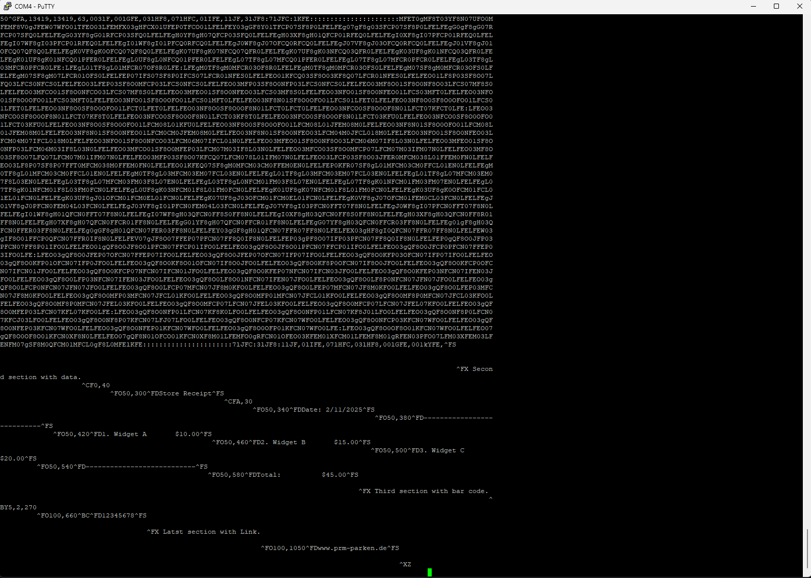
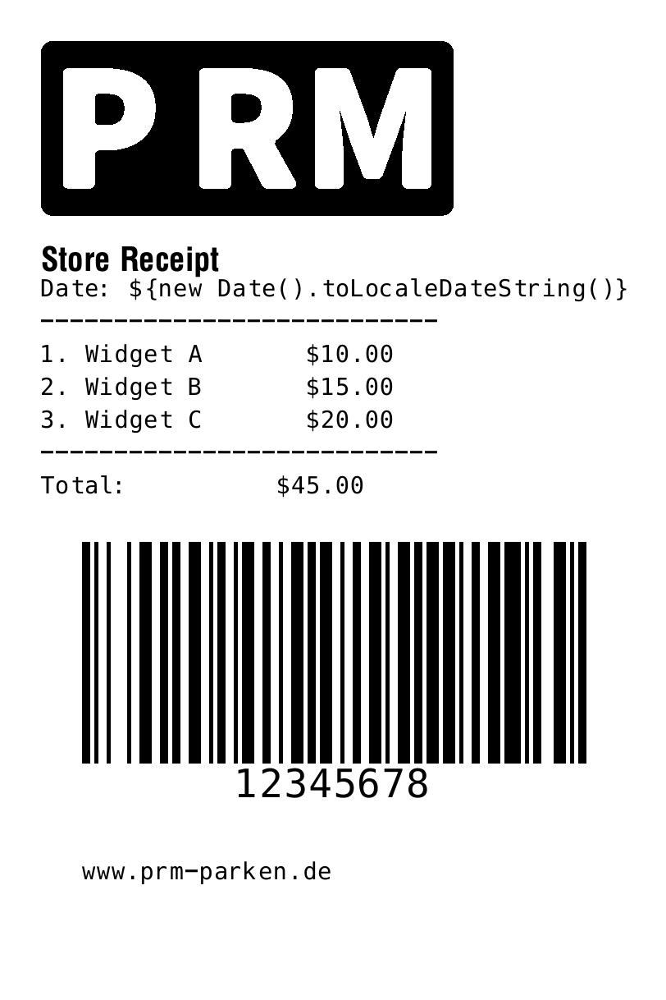
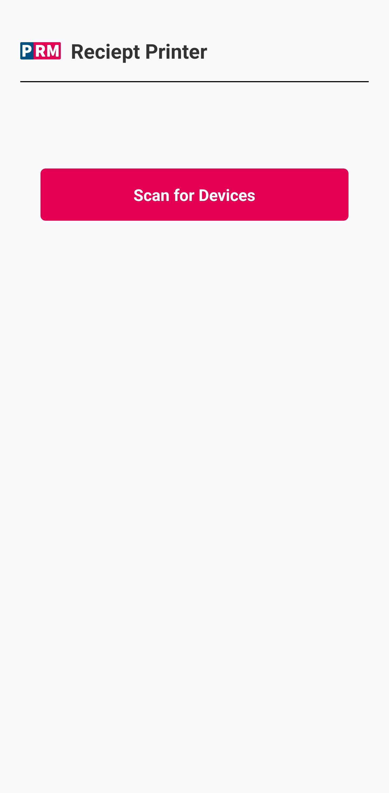
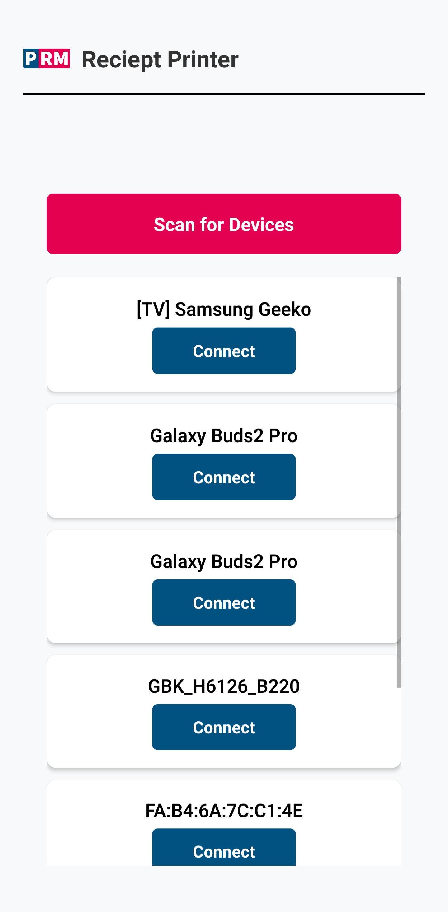
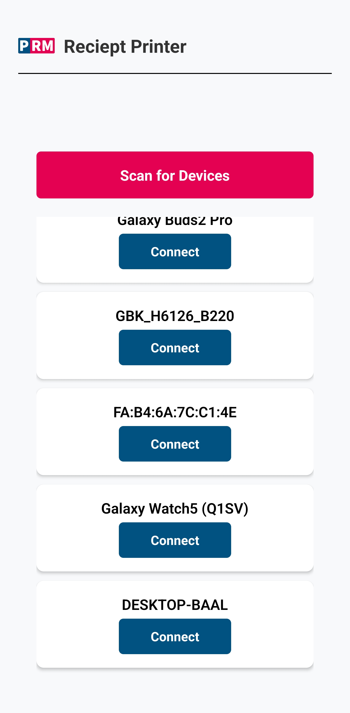
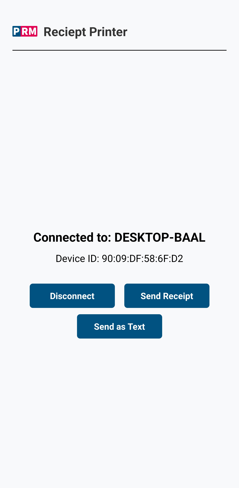
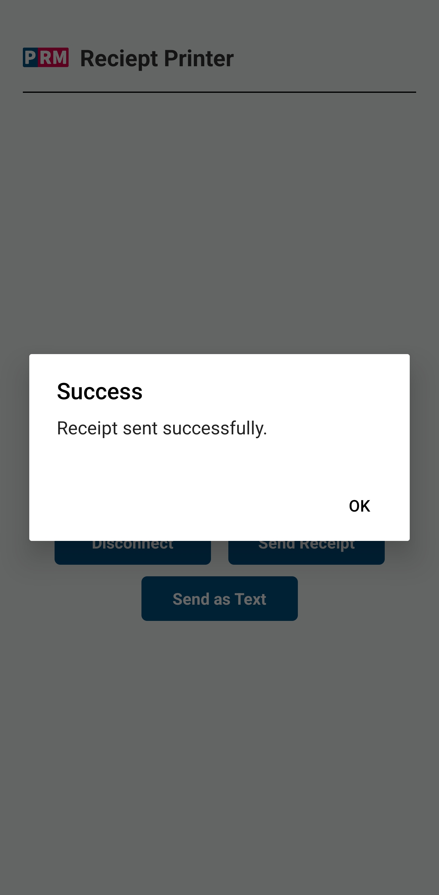

# Zebra Reciept Printer

A React Native project built with Expo that demonstrates scanning, connecting, and sending data via Bluetooth using the `react-native-bluetooth-classic` and `react-native-bluetooth-state-manager` libraries. This project allows you to scan for both paired and unpaired Bluetooth devices, connect to a device, and send data in either ZPL (for receipt printing) or plain text format.

## Installation

```bash
  clone this repo
  cd code-challenge
  npm install -g expo-cli
  npm install
  expo install
```

In app.json, ensure you have the required permissions in the Android section:

```bash
{
  "expo": {
    "android": {
      "permissions": [
        "BLUETOOTH",
        "BLUETOOTH_ADMIN",
        "BLUETOOTH_CONNECT",
        "BLUETOOTH_SCAN",
        "ACCESS_FINE_LOCATION"
      ]
    }
  }
}
```

## Deployment

To run this project

```bash
  npx expo prebuild --platform android
  npx expo run:android
```

## Running Tests

On first launch the application will ask for android permissions:

1. Allow Permision
2. Press "Scan for Devices"
3. If Bluetooth is off then you will be prompt to allow turning it on
4. The list will be shown with exisiting paired devices and unpaired devices
5. Choose a device and press connect
6. Pair the devices if prompted
7. A connected view will be displayed with the device name and MAC address (id)
8. Press "Send Reciept"

I used putty to test the payload is actually being sent.

```bash
Open Bluetooth Devices.
If using Windows 11, navigate: Start-> Settings-> Bluetooth & devices-> Devices-> More Bluetooth settings-> COM Pports-> Add incoming-> press OK.
From the COM Ports tab, click Add.
Ensure 'Incoming (device initiates the connection)' is selected then click OK.
Click OK.
```

```bash
Open Putty
In Session -> connection type -> Select Serial
In the hostname replace COM1 with the COM Port configured in the previous step
Press Open
The putty bash will open and you can see the Bluetooth payload.
```

When you press "Send Reciept" to a connect device (in this test a PC with putty installed) then you should see this output on putty terminal

## Links & Resources

Download the android APK from Expo build dashbaord at [https://expo.dev/accounts/saedr/projects/code-challenge/builds/00a864cd-3e41-47b4-a66b-6a07c6849a5a](https://expo.dev/accounts/saedr/projects/code-challenge/builds/00a864cd-3e41-47b4-a66b-6a07c6849a5a) press on install and scan the QR code to start downloading

System analysis: [Flowchart Diagram of the application](https://www.mermaidchart.com/play?utm_source=mermaid_js&utm_medium=banner_ad&utm_campaign=teams#pako:eNqdlMtT2zAQxv-VHR96y4ErM32YPCBACOTBY-oeVHmTaBCSKymhGYb_vauNbRnK9NBTIvv3fVp9u_JLJm2J2XHW6_UKI61ZqfVxYQDCBp_wGEpcia0OheH3K22f5Ua4AItBhADy70U2D_FJXlVF9gN6vS9wQg9n-GuLPsCJ3mKwNmzgGt2T8l5Z4wk8yE-Y7xPf36B8hJV1kMugdgh9awzSX2tauk9083qAOyURRnZrSjYZxEowgDzosKyJT7BT-DyhU8Ln9PKt55V9ZxsNh7VhR-6lSNUMmRoRtfToQGolHz3MCeFjHJzSUUeMnxI-NOKnxpRMi5wychbTEEaiBmH2YM3aKrOGUnlpd-j2LX7G-JjDDk4hlX8tlMPyr73HTJ63vRo0Xlzp0lQfy85ZdkGyCbo1UjkljJQO2J4Ofu5hkvchL0uHPikvWHkZs6lKEbDlLxXNhDKwHLfsJbOTJkePmjrkQUDbwDraeiJa4YSFVxyX1k1vF7bWlfzT0ldMT1-KbOwb61w7FOW-ccbya5G9HvBpnIsHqjiqrtNBlmMINs0RT0e7x7Qepqi5IU0eAj5VISrqLeLfwdvCbhifUWFp5GG-lRSXX211KmnWLWn-f-M-61S4iBYb-9y5ajB0Ll5BjS7lPGd6STTNTaVFJy-47R5_yeDt-xuBNDYzlKgoCTLntfCwwN9xD6r4nhRT0zSFh7PxH-7QpEpueYO7puOenDrGcRlNaURTuvcseYgSjcJ9kJf_xx1_OHwJDos7XpgjvsIpUnP07QX8RlT0ufTBVtSt7PUPa5WtLQ)

To view the actual Reciept label design open [https://labelary.com/viewer.html](https://labelary.com/viewer.html) and replace the code input field with the following then press redraw

```bash
^XA

^FX First section with logo.
^FO50,50^GFA,13419,13419,63,003lF,00lGFE,03lHF8,07lHFC,0lIFE,1lJF,3lJF8:7lJFC:lKFE::::::::::::::::::::::MFET0gMF8T03YF8N07UFO0MFEMF8V0gJFEW07WFO01TFEO03LFEMFX03gHFCX01UFEP0TFCO01LFELFEY03gGF8Y01TFCP07SF8P0LFELFEg07gF8g03SFCP07SF8P0LFELFEgG0gF8gG07RFCP07SFQ0LFELFEgG03YF8gG01RFCP03SFQ0LFELFEgH0YF8gH07QFCP03SFQ0LFELFEgH03XF8gH01QFCP01RFEQ0LFELFEgI0XF8gI07PFCP01RFEQ0LFELFEgI07WF8gI03PFCP01RFEQ0LFELFEgI01WF8gI01PFCQ0RFCQ0LFELFEgJ0WF8gJ07OFCQ0RFCQ0LFELFEgJ07VF8gJ03OFCQ0RFCQ0LFELFEgJ01VF8gJ01OFCQ07QF8Q0LFELFEgK0VF8gK0OFCQ07QF8Q0LFELFEgK07UF8gK07NFCQ07QFR0LFELFEgK07UF8gK03NFCQ03QFR0LFELFEgK03UF8gK01NFCQ03QFR0LFELFEgK01UF8gK01NFCQ01PFER0LFELFEgL0UF8gL0NFCQ01PFER0LFELFEgL07TF8gL07MFCQ01PFER0LFELFEgL07TF8gL07MFCR0PFCR0LFELFEgL03TF8gL03MFCR0PFCR0LFE:LFEgL01TF8gL01MFCR07OF8R0LFE:LFEgM0TF8gM0MFCR03OF8R0LFELFEgM0TF8gM0MFCR03OFS0LFELFEgM07SF8gM0MFCR03OFS0LFELFEgM07SF8gM07LFCR01OFS0LFELFEP07IFS07SF8P0IFCS07LFCR01NFES0LFELFEO01KFCQ03SF8O03KF8Q07LFCR01NFES0LFELFEO01LF8P03SF8O07LFQ03LFCS0NFCS0LFELFEO03LFEP03SF8O0MFCP03LFCS0NFCS0LFELFEO03MFP03SF8O0NFP03LFCS0NFCS0LFELFEO03MF8O01SF8O0NF8O03LFCS07MF8S0LFELFEO03MFCO01SF8O0NFCO03LFCS07MF8S0LFELFEO03MFEO01SF8O0NFEO03LFCS03MF8S0LFELFEO03NFO01SF8O0NFEO01LFCS03MFT0LFELFEO03NFO01SF8O0OFO01LFCS03MFT0LFELFEO03NFO01SF8O0OFO01LFCS01MFT0LFELFEO03NF8N01SF8O0OFO01LFCS01LFET0LFELFEO03NF8O0SF8O0OFO01LFCS01LFET0LFELFEO03NF8O0SF8O0OFO01LFCT0LFET0LFELFEO03NF8O0SF8O0OF8N01LFCT0LFCT0LFELFEO03NFCO0SF8O0OF8N01LFCT07KFCT0LFE:LFEO03NFCO0SF8O0OF8N01LFCT07KF8T0LFELFEO03NFCO0SF8O0OF8N01LFCT03KF8T0LFELFEO03NFCO0SF8O0OF8N01LFCT03KFU0LFELFEO03NFCO0SF8O0OFO01LFCT03KFU0LFELFEO03NF8O0SF8O0OFO01LFCM08L01KFU0LFELFEO03NF8O0SF8O0OFO01LFCM08L01JFEM08M0LFELFEO03NF8N01SF8O0OFO01LFCM08L01JFEM08M0LFELFEO03NF8N01SF8O0NFEO01LFCM0CM0JFEM08M0LFELFEO03NF8N01SF8O0NFEO03LFCM04M0JFCL018M0LFELFEO03NFO01SF8O0NFEO03LFCM04M07IFCL018M0LFELFEO03NFO01SF8O0NFCO03LFCM06M07IFCL01N0LFELFEO03MFEO01SF8O0NF8O03LFCM06M07IF8L03N0LFELFEO03MFEO01SF8O0NFP03LFCM06M03IF8L03N0LFELFEO03MFCO01SF8O0MFEP03LFCM07M03IF8L03N0LFELFEO03MFCO03SF8O0MFCP07LFCM07M03IFM07N0LFELFEO03MF8O03SF8O07LFQ07LFCM07M01IFM07N0LFELFEO03MFP03SF8O07KFCQ07LFCM078L01IFM07N0LFELFEO03LFCP03SF8O03JFER0MFCM038L01FFEM0FN0LFELFEO03LF8P07SF8P07FFT0MFCM038M0FFEM0FN0LFELFEO01KFEQ07SF8gM0MFCM03CM0FFEM0EN0LFELFEP0KFR07SF8gL01MFCM03CM0FFCL01EN0LFELFEgM0TF8gL01MFCM03CM0FFCL01EN0LFELFEgM0TF8gL03MFCM03EM07FCL03EN0LFELFEgL01TF8gL03MFCM03EM07FCL03EN0LFELFEgL01TF8gL07MFCM03EM07F8L03EN0LFELFEgL03TF8gL07MFCM03FM03F8L07EN0LFELFEgL03TF8gL0NFCM01FM03F8L07EN0LFELFEgL07TF8gK01NFCM01FM03FM07EN0LFELFEgL07TF8gK01NFCM01F8L03FM0FCN0LFELFEgL0UF8gK03NFCM01F8L01FM0FCN0LFELFEgK01UF8gK07NFCM01F8L01FM0FCN0LFELFEgK03UF8gK0OFCM01FCL01EL01FCN0LFELFEgK03UF8gJ01OFCM01FCM0EL01FCN0LFELFEgK07UF8gJ03OFCM01FCM0EL01FCN0LFELFEgK0VF8gJ07OFCM01FEM0CL03FCN0LFELFEgJ01VF8gJ0PFCN0FEM04L03FCN0LFELFEgJ03VF8gI01PFCN0FEM04L03FCN0LFELFEgJ07VF8gI03PFCN0FFT07F8N0LFELFEgJ0WF8gI07PFCN0FFT07F8N0LFELFEgI01WF8gH01QFCN0FFT07F8N0LFELFEgI07WF8gH03QFCN0FF8S0FF8N0LFELFEgI0XF8gH03QFCN0FF8S0FF8N0LFELFEgH03XF8gH03QFCN0FF8R01FF8N0LFELFEgH07XF8gH07QFCN0FFCR01FF8N0LFELFEgG01YF8gH07QFCN0FFCR01FF8N0LFELFEgG07YF8gH03QFCN0FFCR03FF8N0LFELFEg01gF8gH03QFCN0FFER03FF8N0LFELFEg0gGF8gH01QFCN07FER03FF8N0LFELFEY03gGF8gH01QFCN07FFR07FF8N0LFELFEX03gHF8gI0QFCN07FFR07FF8N0LFELFEW03gIF8O01FFCP0QFCN07FFR0IF8N0LFELFEV07gJF8O07FFEP07PFCN07FF8Q0IF8N0LFELFEP03gPF8O07IFP03PFCN07FF8Q0IF8N0LFELFEP0gQF8O0JFP03PFCN07FF8P01IFO0LFELFEO01gQF8O0JF8O01PFCN07FFCP01IFO0LFELFEO03gQF8O0JF8O01PFCN07FFCP01IFO0LFELFEO03gQF8O0JFCP0PFCN07FFEP03IFO0LFE:LFEO03gQF8O0JFEP07OFCN07FFEP07IFO0LFELFEO03gQF8O0JFEP07OFCN07IFP07IFO0LFELFEO03gQF8O0KFP03OFCN07IFP07IFO0LFELFEO03gQF8O0KFP01OFCN07IFP0JFO0LFELFEO03gQF8O0KF8O01OFCN07IF8O0JFO0LFELFEO03gQF8O0KF8P0OFCN07IF8O0JFO0LFELFEO03gQF8O0KFCP0OFCN07IFCN01JFO0LFELFEO03gQF8O0KFCP07NFCN07IFCN01JFO0LFELFEO03gQF8O0KFEP07NFCN07IFCN03JFO0LFELFEO03gQF8O0KFEP03NFCN07IFEN03JFO0LFELFEO03gQF8O0LFP03NFCN07IFEN03JFO0LFELFEO03gQF8O0LF8O01NFCN07IFEN07JFO0LFELFEO03gQF8O0LF8P0NFCN07JFN07JFO0LFELFEO03gQF8O0LFCP0NFCN07JFN07JFO0LFELFEO03gQF8O0LFCP07MFCN07JF8M0KFO0LFELFEO03gQF8O0LFEP07MFCN07JF8M0KFO0LFELFEO03gQF8O0LFEP03MFCN07JF8M0KFO0LFELFEO03gQF8O0MFP03MFCN07JFCL01KFO0LFELFEO03gQF8O0MFP01MFCN07JFCL01KFO0LFELFEO03gQF8O0MF8P0MFCN07JFCL03KFO0LFELFEO03gQF8O0MF8P0MFCN07JFEL03KFO0LFELFEO03gQF8O0MFCP07LFCN07JFEL03KFO0LFELFEO03gQF8O0MFCP07LFCN07JFEL07KFO0LFELFEO03gQF8O0MFEP03LFCN07KFL07KFO0LFE:LFEO03gQF8O0NFP01LFCN07KF8K0LFO0LFELFEO03gQF8O0NFP01LFCN07KF8J01LFO0LFELFEO03gQF8O0NF8P0LFCN07KFCJ03LFO0LFELFEO03gQF8O0NF8P07KFCN07LFJ07LFO0LFELFEO03gQF8O0NFCP07KFCN07WFO0LFELFEO03gQF8O0NFCP03KFCN07WFO0LFELFEO03gQF8O0NFEP03KFCN07WFO0LFELFEO03gQF8O0NFEP01KFCN07WFO0LFELFEO03gQF8O0OFP01KFCN07WFO0LFE:LFEO03gQF8O0OF8O01KFCN07WFO0LFELFEO07gQF8O0OF8O01KFCN0XF8N0LFELFEO07gQF8N01OFCO01KFCN0XF8M01LFEMFO0gRFCN01OFEO03KFEM01XFCM01LFEMF8M01gRFEN03PFO07LFM03XFEM03LFENFM07gSF8M0QFCM01MFCL0gF8L0MFElKFE::::::::::::::::::::::7lJFC:3lJF8:1lJF,0lIFE,07lHFC,03lHF8,00lGFE,001kYFE,^FS


^FX Second section with data.
^CF0,40
^FO50,300^FDStore Receipt^FS
^CFA,30
^FO50,340^FDDate: 11.02.2025^FS
^FO50,380^FD---------------------------^FS
^FO50,420^FD1. Widget A       $10.00^FS
^FO50,460^FD2. Widget B       $15.00^FS
^FO50,500^FD3. Widget C       $20.00^FS
^FO50,540^FD---------------------------^FS
^FO50,580^FDTotal:          $45.00^FS

^FX Third section with bar code.
^BY5,2,270
^FO100,660^BC^FD12345678^FS

^FX Latst section with Link.

^FO100,1050^FDwww.prm-parken.de^FS

^XZ

```

You should see this output on that link (Note the actual result will include a date like 11.02.2025 not the JS syntax like shown in the Putty output above) 

NPM Packages:

1. [https://github.com/kenjdavidson/react-native-bluetooth-classic](https://github.com/kenjdavidson/react-native-bluetooth-classic)
2. [https://kenjdavidson.com/react-native-bluetooth-classic/api/](https://kenjdavidson.com/react-native-bluetooth-classic/api/)
   1. [https://www.npmjs.com/package/react-native-bluetooth-state-manager](https://www.npmjs.com/package/react-native-bluetooth-state-manager)

APP Screenshots:

1. 
2. 
3. 
4. 
5. 
